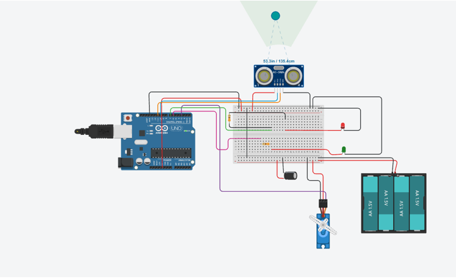
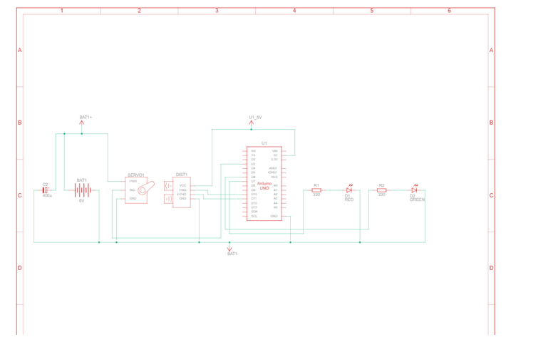

# Intelligent Obstacle Detection & Ranging System

##  Project Overview
This project implements a **Servo-Based Ultrasonic Radar** capable of detecting obstacles within a 150cm range. It was designed to provide spatial awareness for an autonomous waste segregation robot.

The system sweeps a sensor through a 180° arc, mapping the environment in real-time. The core engineering achievement of this project was stabilizing sensitive sensor data in a high-noise electromechanical environment using hardware isolation techniques.

## Key Features
* **180° Spatial Mapping:** Sweeps a standard HC-SR04 sensor from 15° to 165°.
* **Hardware Noise Rejection:** Uses a dual-power design to physically isolate motor noise from sensor logic.
* **Smart Alert Logic:**
    *  **RED LED (< 150 cm):** Obstacle Detected (Active Low Logic).
    *  **GREEN LED (> 150 cm):** Path Clear.
* **Background Rejection:** Tuned thresholding ignores the back wall (approx. 223 cm) and focuses on foreground objects.

## Hardware Pinout
| Component | Arduino Pin | Description |
| :--- | :--- | :--- |
| **Servo Motor** | Pin 3 | PWM Signal for scanning |
| **HC-SR04 Trig** | Pin 9 | Ultrasonic Trigger Pulse |
| **HC-SR04 Echo** | Pin 10 | Echo Return (Input) |
| **Green LED** | Pin 6 | Status: Safe / Clear |
| **Red LED** | Pin 7 | Status: Object Detected |

##  Challenges Faced & Solutions

During the development of this prototype, I encountered significant hardware instability issues that are common in mixed-signal robotics but often overlooked in basic tutorials.

### 1. The Problem: Shared Power Instability
Initially, both the **HC-SR04 Sensor** and the **Servo Motor** were powered directly from the Arduino's 5V rail. This resulted in two critical failure modes:
* **Sensor Drift:** The servo motor drew high current spikes during startup and movement, causing voltage drops on the 5V line. This starved the ultrasonic sensor, resulting in random "garbage values".
* **Servo Jitter:** The sudden voltage fluctuations caused the servo to twitch and "jitter" uncontrollably, failing to hold a steady angle.

### 2. The Solution: Isolation & Filtering
To solve these issues, I moved from a software-based fix to a hardware-based solution:
* **Split-Power Architecture:** I introduced a separate **4xAA Battery Pack (6V)** dedicated solely to the Servo Motor. The Arduino's 5V regulator was then reserved strictly for the sensitive Ultrasonic Sensor and logic.
* **Common Grounding:** A critical common ground connection was established between the external battery and the Arduino to ensure the PWM control signal remained valid.
* **Noise Suppression:** A **400µF Electrolytic Capacitor** was placed across the servo's power rails. This capacitor acts as a local energy reservoir, absorbing voltage spikes and smoothing out the power delivery, which completely eliminated the servo jitter.

### Circuit Diagrams
Here is the noise-suppression circuit design used to isolate the servo power:

| Breadboard View | Schematic View |
| :---: | :---: |
|  |  |

###  Project Demo

> *Click the image above to watch the full working prototype on YouTube.*

## ⚙️ How to Run
1.  Open `Intelligent_Obstacle_Detection_and_Ranging_System.ino` in the Arduino IDE.
2.  Install the standard `Servo` library.
3.  Connect the wiring according to `circuit_diagram.png`.
    * **CRITICAL:** Ensure the Servo power (+) is connected to the Battery, NOT the Arduino 5V.
    * **CRITICAL:** Ensure the Capacitor is connected correctly (observe polarity) across the servo power rails.
4.  Upload the code.
5.  Open Serial Monitor (9600 Baud) to view real-time distance data.

*Created by Damodar Barhate*